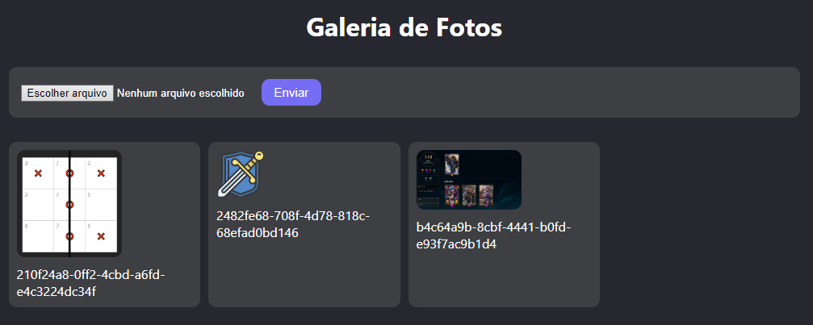

# Projetos com React e Javascript

## Objetivo
Nada é mais efetivo para se aprender do que a prática constante. Com isso em mente, desenvolvi este repositório com o propósito de reunir ideias para projetos pequenos que possam auxiliar aqueles que estão iniciando no mundo do desenvolvimento web, utilizando tecnologias como React e JavaScript.

Os projetos contidos neste repositório podem ser acompanhados através do resultado final, análise do código fonte que mostram o processo de desenvolvimento passo a passo.

Se você se interessou pela ideia, confira os projetos abaixo:

<table border="2">
  <tr>
    <td>
        <h3>00 - Pokédex</h3>
        <li><a href="./Pokedex/">Código</a></li>
        
    </td>
      <td>
        <h3>01 - Jogo da memória</h3>
        <li><a href="./MemoryGame/">Código</a></li>
        
    </td>
    <td>
      <h3>02 - Jogo da Velha</h3>
      <li><a href="./TictacToe/">Código</a></li>
      
    </td>
  </tr>
  <tr>
    <td>
      <h3>03 - Galeria de Fotos</h3>
      <li><a href="./GalleryPhotos/">Código</a></li>
      
    </td>
  </tr>
</table>
